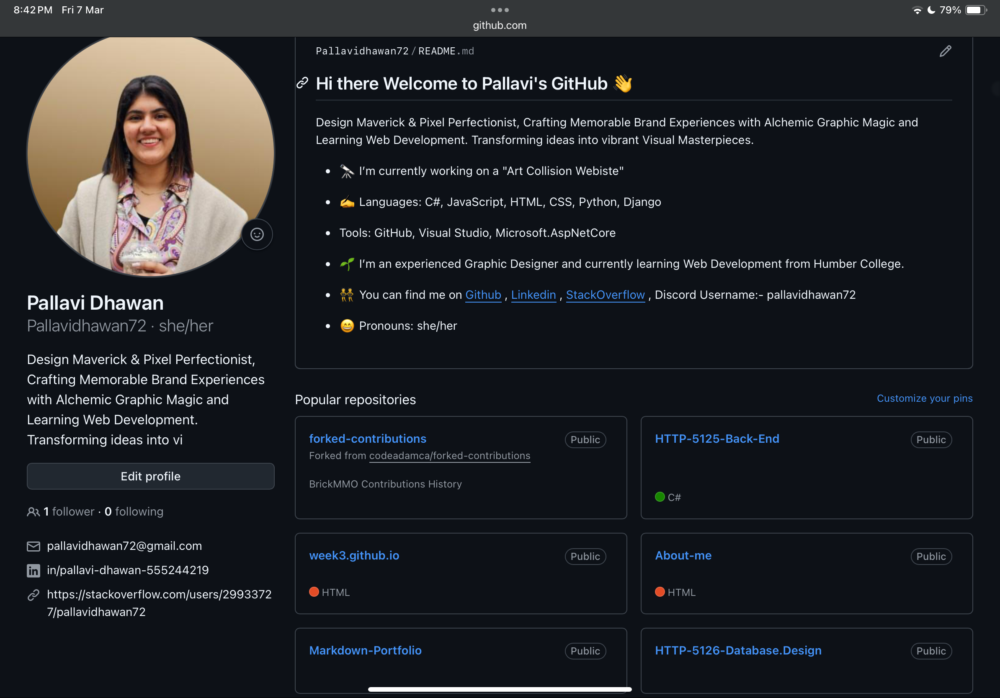

# Workshops Webdev
This repository shows my projects/assignments of different languages and using GitHub, Stackoverflow etc.

## Information
In this course, I'm learning to use GitHub

## My Repository

## Links
You can find my GitHub Link Here[GitHub](https://github.com/Pallavidhawan72)
